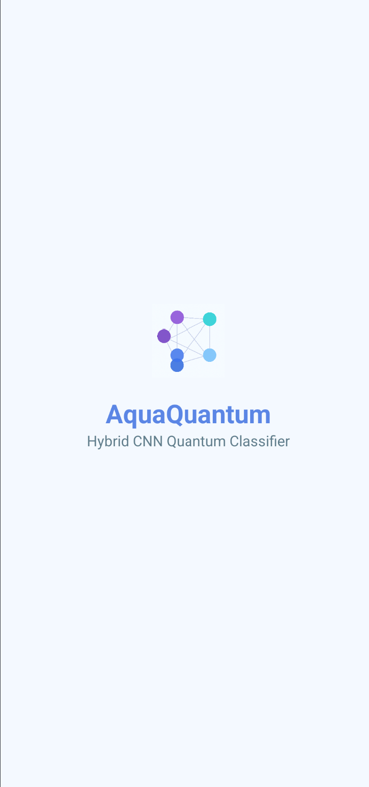
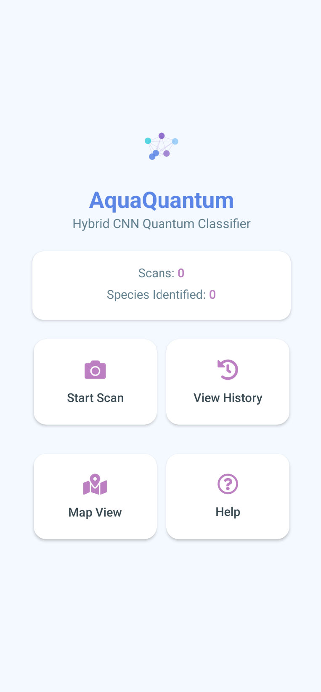
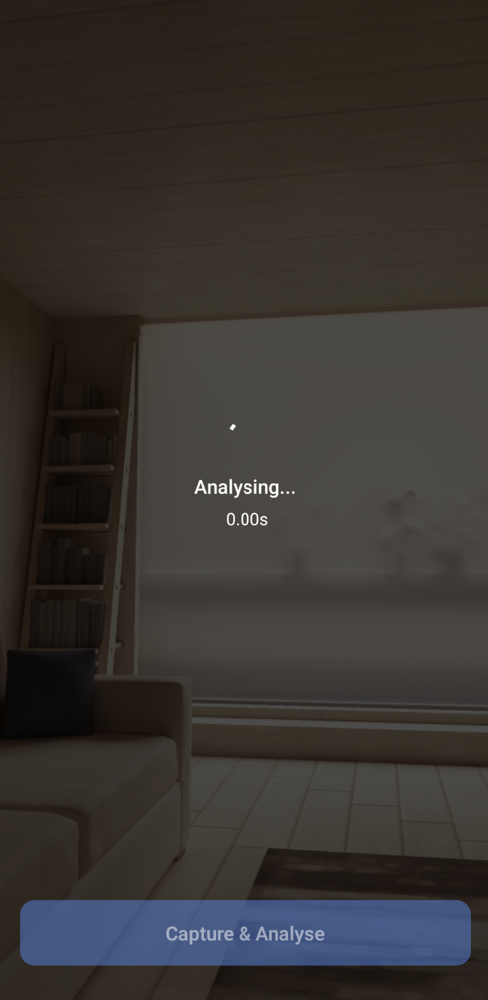
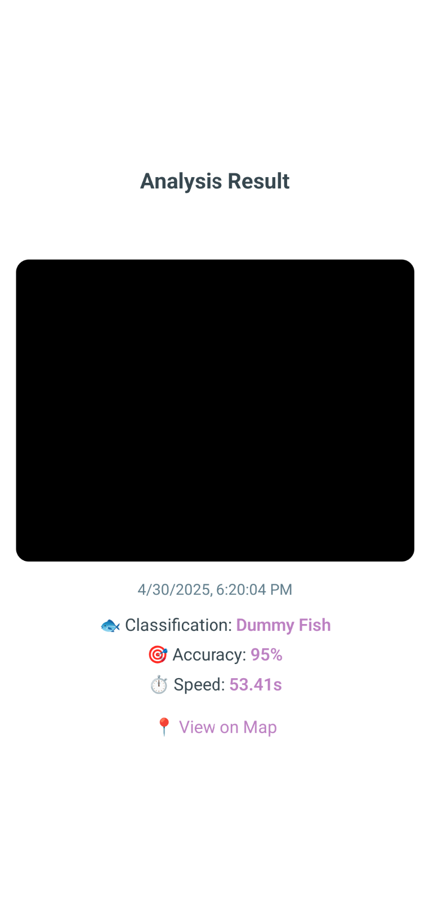
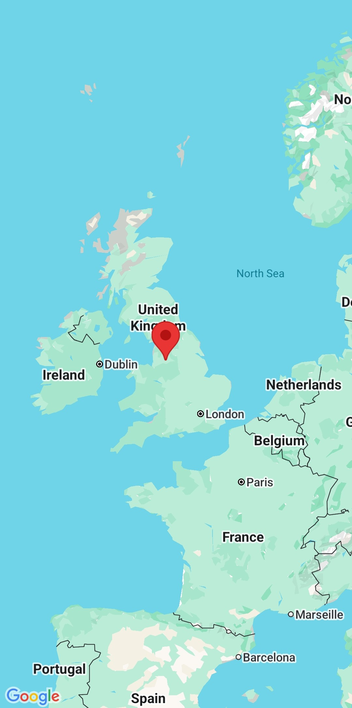
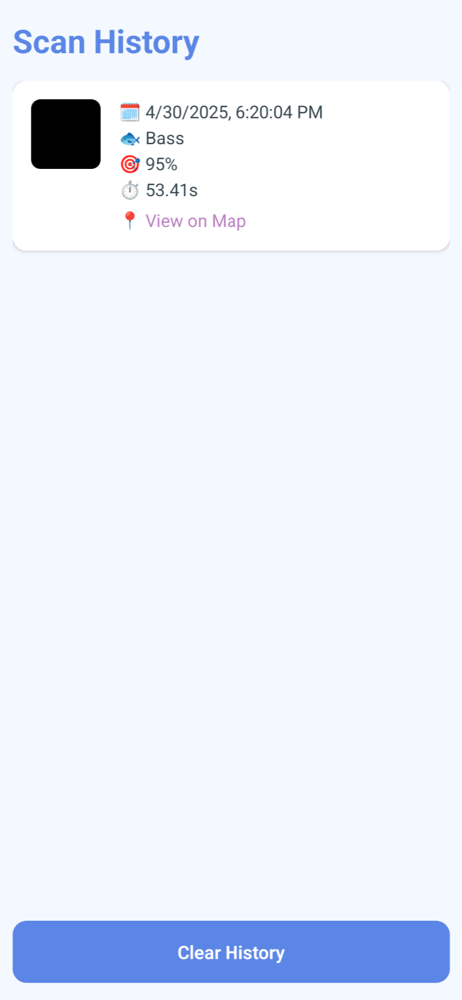

# AquaQuantum 🐟🔬

**AquaQuantum** is a hybrid AI-powered mobile app for identifying fish species using a Convolutional Neural Network (CNN) enhanced with a Quantum Neural Network (QNN). It provides real-time classification, geotagging, and scan history via a user-friendly mobile interface powered by React Native and Expo.

> 💡 Built with PyTorch, PennyLane, FastAPI, and Expo (React Native)

---

## 📱 Features

- 📷 **Camera-based Capture**: Use your device camera to capture fish images.
- ⚛️ **Quantum Hybrid Classifier**: Combines EfficientNet-B0 CNN with a 4-qubit Quantum Neural Network.
- 🗺️ **Geotagging**: Saves location data of each scan if permission is granted.
- 📖 **Scan History**: Stores all classified images with metadata.
- 🧭 **Map Visualization**: Visualize previous scans pinned on a map.
- 📊 **Statistics Dashboard**: Displays total scans and unique species count.
- 📘 **Interactive Help Guide**: Easily understand app functionality.
- 🔗 **Backend API**: Built with FastAPI to serve a quantum-enhanced classification model.
- 🧪 **Supports Offline History Storage**: Uses local device storage.

---

## 🛠️ Installation & Setup

### 📦 Backend (Quantum Hybrid Model Server)

1. **Install dependencies:**

```bash
pip install torch torchvision torchaudio
pip install pennylane pennylane-lightning
pip install matplotlib scikit-learn tqdm fastapi uvicorn
```

2. **Ensure the following files exist in the backend directory:**

* `server.py` (FastAPI server)
* `main.py` (Hybrid model definition)
* `hybrid_qcnn_model_v1.0.pth` (Pretrained weights)
* `species_mapping.json` (ID to species mapping)

3. **Run the server:**

```bash
uvicorn server:app --reload --host 0.0.0.0 --port 8000
```

### Backend Architecture Overview

* `HybridModel`: Combines EfficientNet-B0 CNN (PyTorch) with a custom quantum layer using PennyLane.
* Quantum Circuit: 4-qubit system with angle embedding and entangling layers.
* `FastAPI`: Handles image upload and prediction endpoint `/predict/`.
* Predictions include class ID, species name, and confidence.

Example response:

```json
{
  "class_id": 12,
  "class_name": "Rainbow Trout",
  "confidence": 98.73
}
```

### 📱 Mobile App (Expo/React Native)

1. **Install dependencies:**

```bash
npm install
```

2. **Start the app:**

```bash
npx expo start
```

3. **Required Configuration:**

* Update the IP under `API_URLS.dev` in `api.js` to your server's IP (e.g., `http://192.168.1.x:8000`)

4. **Permissions Required:**

* Camera access
* Location access (optional but enhances experience)

---

## 🚀 How to Use
1. Launch the App – The splash screen leads to the Home.

2. Start a Scan – Navigate to the camera, capture an image.

3. Receive Analysis – Image is classified by the backend model and metadata is recorded.

4. View Results:

- 🗂️ History Tab: Review your past scans

- 🗺️ Map Tab: Explore geolocated results

5. Use Help Tab – Get user guidance at any time.

## 📈 Planned Improvements
- ✅ Replace dummy classification on frontend with live API prediction.

- 🧠 Improve QNN architecture and extend quantum layers.

- ☁️ Deploy FastAPI on cloud or use tunneling for public access.

- 📲 Expand iOS support and responsive design.

- 📤 Add user account integration for sync and backup.

- 🔍 Add filtering options in history view.

## 👨‍🎓 Academic Notice
This project is developed as part of a final year Synoptic Project. It explores quantum-enhanced machine learning using PennyLane and PyTorch and serves as a demonstrator for hybrid quantum-classical pipelines applied in real-world mobile environments.

## 👨‍💻 Author
**Name:** Amar Mukhtar Mohammed

**Institution:** The Manchester Metropolitan University

**Course:** B.Sc Computer Science

**Supervisors:** Dr. Kate MacFarlane & Dr. Matthew Shardlow

## 📂 Project Directory Structure

```plaintext  
├── Home Server/  
│   ├── server.py               → FastAPI server for classification  
│   ├── hybrid_qcnn_model_v1.0.pth  → Trained PyTorch model  
│   ├── species_mapping.json    → ID to species name map  

├── Expo React Native App/  
│   ├── AppNavigator.js         → App routing and screens  
│   ├── CameraScreen.js         → Main scan/capture logic  
│   ├── HistoryScreen.js        → Saved results viewer  
│   ├── MapScreen.js            → Geotag visualization  
│   ├── HelpScreen.js           → Help and usage instructions  
│   ├── api.js                  → Image upload and classification request  
│   ├── HomeScreen.js           → Dashboard with stats and navigation  
│   ├── SplashScreen.js         → Intro loading screen  

```

## 🧪 Example API Usage
- Endpoint: POST /predict/
- Payload: JPEG image
Response:

```json
{
  "class_id": 12,
  "class_name": "Rainbow Trout",
  "confidence": 98.73
}
```

## 🧠 Tech Stack
- Frontend: React Native + Expo

- Backend: FastAPI, PyTorch, PennyLane

- Quantum Engine: PennyLane Lightning

- Model: EfficientNet-B0 + BasicEntanglerLayers

- Storage: AsyncStorage (local)

- Map: react-native-maps

## 📸 Screenshots

> Disclaimer: The data shown in the screenshots below is dummy data and used for demonstration purposes only. 

### 🔍 Home View 
  


### 🧾 Camera View
  


### 🗺️ Map View


### 🧾 History Log



## 🧾 Development Environment Info

The following environment was used during the development of AquaQuantum:

```powershell
PS C:\Users\amarm\OneDrive - MMU\Year 3\Synoptic Project(1)\Expo React Native App\AquaQuantum> npx envinfo --system --binaries --npmPackages --npmGlobalPackages

System:
  OS: Windows 11 10.0.26100
  CPU: (16) x64 12th Gen Intel(R) Core(TM) i7-1270P
  Memory: 17.27 GB / 31.67 GB
Binaries:
  Node: 22.13.1 - C:\Program Files\nodejs\node.EXE
  npm: 11.1.0 - C:\Program Files\nodejs\npm.CMD
npmPackages:
  @babel/core: ^7.20.0 => 7.26.10 
  @expo/vector-icons: ^14.0.2 => 14.0.4 
  @react-native-async-storage/async-storage: ^2.1.2 => 2.1.2 
  @react-navigation/native: ^7.0.18 => 7.0.19 
  @react-navigation/native-stack: ^7.3.2 => 7.3.3 
  @types/react: ~18.3.12 => 18.3.20 
  expo: ~52.0.42 => 52.0.42
  expo-camera: ~16.0.18 => 16.0.18
  expo-image-picker: ~16.0.6 => 16.0.6
  expo-linear-gradient: ~14.0.2 => 14.0.2
  expo-location: ~18.0.10 => 18.0.10
  expo-media-library: ~17.0.6 => 17.0.6
  expo-status-bar: ~2.0.1 => 2.0.1
  lottie-ios: ^4.5.1 => 4.5.1
  lottie-react-native: 7.1.0 => 7.1.0
  react: 18.3.1 => 18.3.1
  react-native: ^0.76.8 => 0.76.8
  react-native-gesture-handler: ~2.20.2 => 2.20.2
  react-native-maps: 1.18.0 => 1.18.0
  react-native-reanimated: ~3.16.1 => 3.16.7
  react-native-safe-area-context: 4.12.0 => 4.12.0
  react-native-screens: ~4.4.0 => 4.4.0
  react-native-svg: 15.8.0 => 15.8.0
  typescript: ^5.3.3 => 5.8.2
npmGlobalPackages:
  expo-cli: 6.3.12
  npm: 11.1.0
```

The following environment is of the Ubuntu home server, where the model was deployed

```powershell

annotated-types==0.7.0
anyio==4.9.0
appdirs==1.4.4
astunparse==1.6.3
autograd==1.7.0
autoray==0.7.1
cachetools==5.5.2
certifi==2025.4.26
charset-normalizer==3.4.1
click==8.1.8
diastatic-malt==2.15.2
exceptiongroup==1.2.2
fastapi==0.115.12
filelock==3.18.0
fsspec==2025.3.2
gast==0.6.0
h11==0.16.0
idna==3.10
Jinja2==3.1.6
MarkupSafe==3.0.2
mpmath==1.3.0
networkx==3.4.2
numpy==2.2.5
nvidia-cublas-cu12==12.6.4.1
nvidia-cuda-cupti-cu12==12.6.80
nvidia-cuda-nvrtc-cu12==12.6.77
nvidia-cuda-runtime-cu12==12.6.77
nvidia-cudnn-cu12==9.5.1.17
nvidia-cufft-cu12==11.3.0.4
nvidia-cufile-cu12==1.11.1.6
nvidia-curand-cu12==10.3.7.77
nvidia-cusolver-cu12==11.7.1.2
nvidia-cusparse-cu12==12.5.4.2
nvidia-cusparselt-cu12==0.6.3
nvidia-nccl-cu12==2.26.2
nvidia-nvjitlink-cu12==12.6.85
nvidia-nvtx-cu12==12.6.77
packaging==25.0
PennyLane==0.41.0
PennyLane_Lightning==0.41.0
pillow==11.2.1
pydantic==2.11.3
pydantic_core==2.33.1
python-multipart==0.0.20
requests==2.32.3
rustworkx==0.16.0
scipy==1.15.2
scipy-openblas32==0.3.29.0.0
six==1.17.0
sniffio==1.3.1
starlette==0.46.2
sympy==1.13.3
termcolor==3.0.1
tomlkit==0.13.2
torch==2.7.0
torchaudio==2.7.0
torchvision==0.22.0
triton==3.3.0
typing-inspection==0.4.0
typing_extensions==4.13.2
urllib3==2.4.0
uvicorn==0.34.2

```

## 📜 License
This is a student research project. Not for commercial use. The project was developed in full compliance with MMU academic integrity policies,


